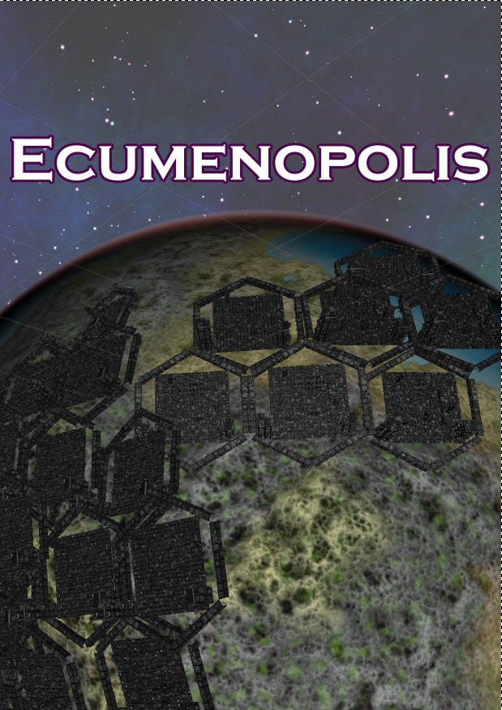
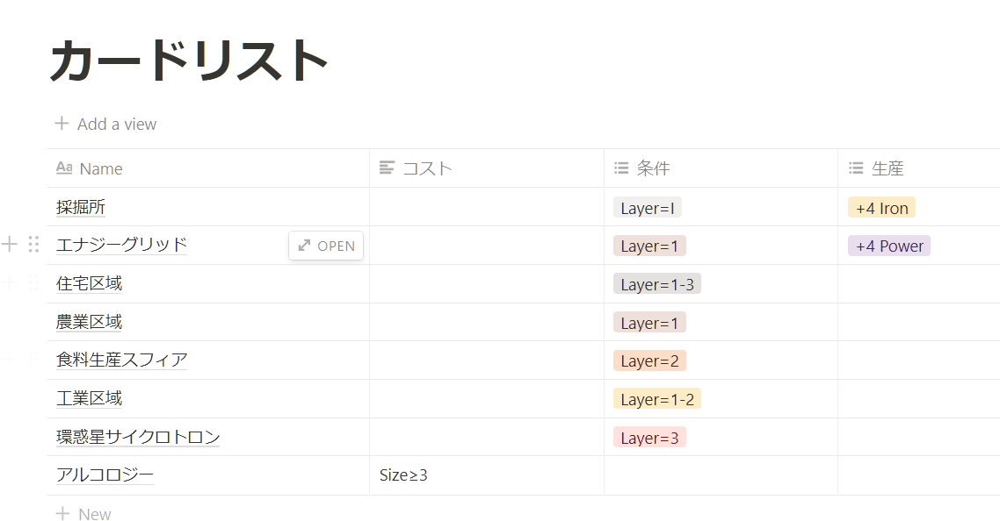

# 今週の進捗(無)

## 2021.11.27 モチ会 76 回

### tackman

---

# 今週の進捗

## 先週はゲームマーケットでした

- なんだかんだで参加すると良いことがあった
- ゲーム作りたいにもなる
- ゲーム作りたいになったので久々に妊活してる

---

# 新作はここ(こめかみを親指で指す)にあるんですよ

- ゲームのコア＆基本ルールを書き出したりしている
- タイトル駆動的なやつをやってみたくてUnityいじったりした
  - Single’s Dayのセールで買ったアセット使ってみたかった
  - クオリティ出そうとすると思ったより手間が必要な題材だと気づいた
  - 高解像度対応できるimage-to-image GANとか噛ませてみたい
    - あるいは低解像度画像を生成してから超解像技術というアプローチも？

---

# notion便利ですね

- 基本はメモ書きWebアプリなので、壁打ち兼ねて書き出すのに使える
  - 今回はほとんどの企画情報がnotion上にある
- 一方でテーブル機能や簡易DB機能もあるので、カードリストも一括管理できる可能性も感じている
- （今回は使ってないけれど）数式入力が便利過ぎてロックインされています
- なお労働でも社のnotionを使っていて、複数アカウントでまあまあ破滅している
  - FirefoxとChromeでアカウントを使い分ける苦肉の対応をしている

---

# その他

エキュメノポリス（惑星全域が人工物で覆われるようになった都市天体）なので、アイザック・アシモフの銀河帝国の首都星トランターの描写が欲しくて「ファウンデーションシリーズ」4作目「ファウンデーションの彼方へ」を読んだ。アオハルしてこなかった老歴史学者に萌え萌え理想の人工美少女の彼女が出来ていた。黒髪茶眼美少女だったしアジアンの萌え文化の生き残りっぽい。アシモフ先生…トランター自体は本作には出て来なかったけれど、ファウンデーションシリーズ第7作ではトランターで労働をする偉人の話らしいのでそこでトランターの描写はありそうと期待している。