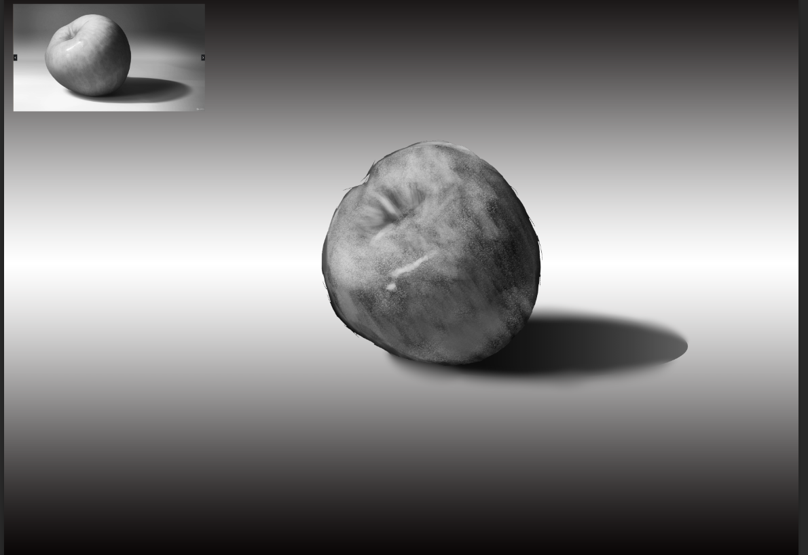
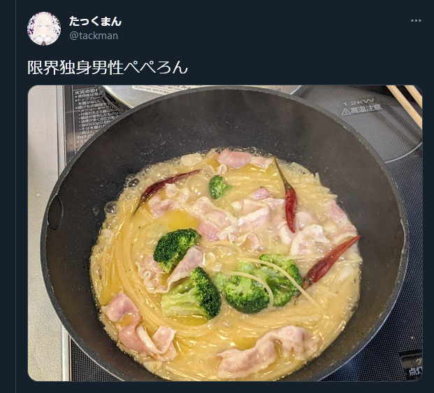

# 今週の進捗

## 2021.12.25 モチ会 78 回

### tackman

---

# 今週の進捗

- Udemyでアートワーク講座をやってみた
  - 次回コミティアまで若干期間があるので、今のうちにインプットしたい
- 初回90%オフだったのでコンセプトアートと Enviromnental Art の講座を購入
- 今週は同じ講師の Art Fundamentals(無料) コースを受講してみた
  - https://www.udemy.com/course/art-fundamentals-in-one-hour/

---

# Udemyの感想

- 日本語に一切期待してはいけない / 日本語講座も存在はするけど数が少なすぎる
  - 数の少なさは質の低さに直結している
- 英語字幕は比較的信頼できるので、リスニングの弱さは補える
- アメリカ英語の世界なので、語学的には分かりやす方のはず
- 全体的に有料専門サービスなだけのクオリティはありそう
- 高評価でも内容はピンキリ・合う合わないがあるので、探すのが一仕事ではる

総合的に：英語の講座でやっていけそうならアリ

↓ Value Painting をやってみたやつ

---

# その他

- 雑アーリオ・オーリオ・ペペロンチーノの作り方を覚えた
  - https://www.youtube.com/watch?v=Jx-tqntWPCM
  - これベースにアレンジしてる
- フライパンだけで具材調理と茹でが完結して助かる
- 自宅にあるものでできるので、冬場外出したくない時に助かる

