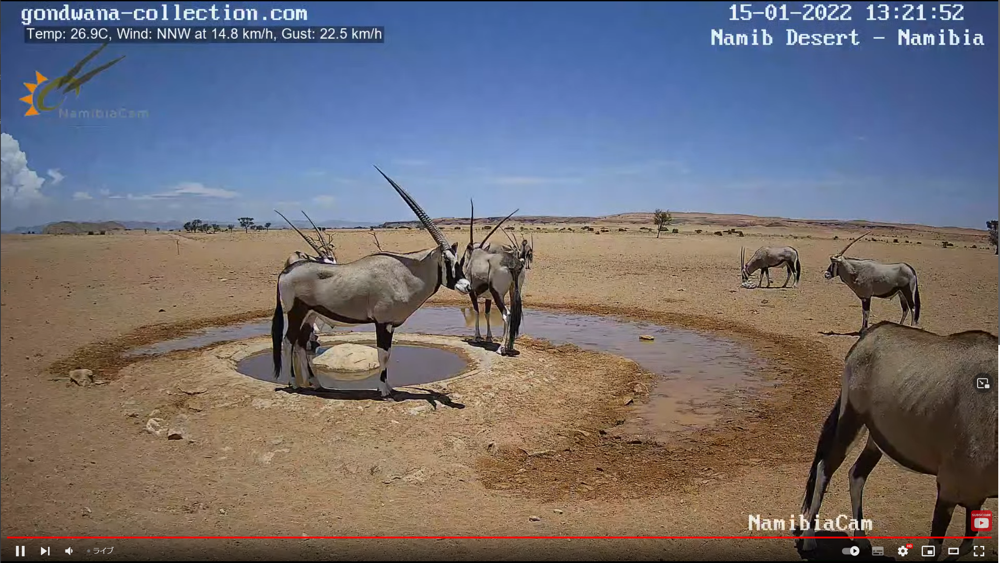

# 今回の進捗

## 2022.01.15 モチ会 79 回

### tackman

---

# やったこと① Environemnt Art講座

- 前回紹介したUdemyのやつをちょくちょく進めてる
- 分量的にそこまで多くはないのでこの土日で7割型やってしまいたい

↑は空の描き方講座的なやつ試した結果（講座ではもっとちゃんとした絵を描いてる）

---

# やったこと？② ボードゲームの公理の検討

https://zenn.dev/tkmn/scraps/f47062b8a67900

- 労働の間で怪文書を書き出してしまった
- 「ボードゲーム」の一番外側を規定したいという動機
- ボードゲーミングプラットフォームのダシにするのが目的
  - この2年くらいアイディアのスクラップ＆ビルドしてる
  - O株流行で作る理由が復活してしまった

---

# ナミビア砂漠のカメラ紹介

- https://www.youtube.com/watch?v=ydYDqZQpim8
- テレビ用モニタで24時間垂れ流してる
- 作業用BGVに良い　音も風音のみが適度に入るので邪魔しない

