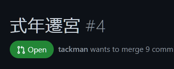
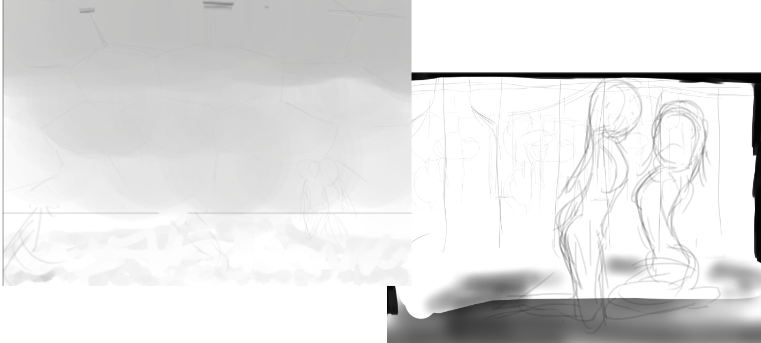

# 今回の進捗

## 2022.02.05 モチ会 82 回

### tackman

---

# 確定申告いかがですか

## choubo.jsのアップデート

1年ぶりくらいに触るにあたって色々更新することになった

- react-routerを捨てるためCRAからnext.jsに乗り換え
- Firebase SDK 7 -> 9へのアップデート
  - 書き方が変わっていたけど機械的置き換えで対応できていて助かった
  - firebaseuiが死んだ(Firebase9非対応）けどそこまで困らなかった
- CSSフレームワークをtailwindに置き換えることに決定した
  - date-fnsとmaterial-uiのDatePickerの組み合わせが破滅したので

---

# (neo)vimでのフロントエンドコーディング

[以前紹介した記事](https://zenn.dev/yano/articles/vim_frontend_development_2021)の実践編

- 特にvimmerじゃないけど普通にやれる
  - Language Serverはやはりえらい
- VSCodeと生産性に大差はないけれど、ssh経由で大差ないのがえらい
  - 開発機(Linuxデスクトップ)にWin(WSL)からつないで作業可能

---

# コーディング配信をやろうとした

フロントエンド開発でバエるのでは？と思ったけれど、ブラウザを映すのは色々な問題があった

- ブラウザで本番データが表示される場合に秘匿情報ダダ漏れになる
  - 今回の場合は私の会計情報・費用売上が大公開される
- そもそもブラウザ自体センシティブな情報が表示されやすい
  - ツールバーですら結構嫌なことがある

意外とやれた部分もあり:

- vimの画面を映す分には基本的にそのままやれそうな雰囲気

---

# 補足：コーディング配信を思い立った理由

- udemyの動画講座で、入門レベルでの動画の有用性に目覚めた
- プログラミング初心者のコーディング配信を見たいという声

配信やって教材化できるならいいなと思ったけれど、なかなか現実は厳しい

---

# コミティア140準備

- choubo.js式年遷宮が始まったので作業量的にはあまりやれず
- 構図を描いては捨てるを繰り返してる
  - 風景の構図、むずかしい
  - そんなペースで間に合うのか？

---

# 雑談：ロフティースマイル、出走です！

### 2/6(日) 小倉2R 3歳未勝利牝馬限定芝1800m

https://race.netkeiba.com/race/shutuba.html?race_id=202210010802&rf=shutuba_submenu

5枠9番でいいところもらいました！
鞍上が見習いジョッキーということでトップハンデと斤量-3kg
グリーンチャンネルに課金しなきゃ・・・