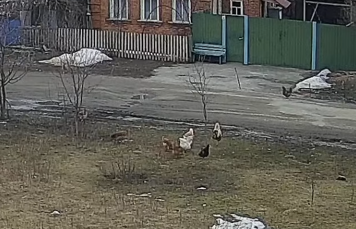

# 今回の進捗

## 2022.02.26 モチ会 84 回

### tackman

---

# 今週の進捗

### 税務署に確定申告提出してきた

- 書類作成は先週段階で終わっていた、つもりが盛大に予定納税額を過少申告状態
  - 一晩寝かせるのは大事だった
- チャリで(行って)来た。ADACHIで最強の交通手段こと自転車

### GCPの整理

- 費用計上したタイミングで整理の必要性を感じたので
- Computeのディスクは地味に費用がかさみますね
  - バックアップ取ってインスタンスと合わせて削除

---

# コミティア準備

- 2月が終わってしまうけどまだ方向性で迷っている状態
- 遠景だと女の子描けなくない？と手を動かし始めてから気づく
- それはそれとして建築様式について資料集めなど
  - [ザハ](https://www.thespruce.com/architect-zaha-hadid-5078666)、ええやんになってる
  - イスラム建築の系譜をひきつつ女性で未来的なデザインで
    - 日本では国立競技場のアレで微妙な印象が残ったけれど・・・

---

# その他

- ウクライナのライブカムをあれこれ見たりしている
- 割と世界中いろんなところにライブカムがある

前線に近い都市とされる場所のライブカムより。鶏の放牧を眺めることになったり

---

# 今日のロフティースマイル

- 牝馬未勝利　小倉5R芝1800
- 16番大外枠からの7着
- 好スタートから好位につけるも、1000m63秒台の超スローからの上がり勝負についていけず
  - キレるタイプではないので、まだまだ終盤が課題・・・
- 同レースデビューのゴールドエクリプス(父ドゥラメンテ)は今後面白そう