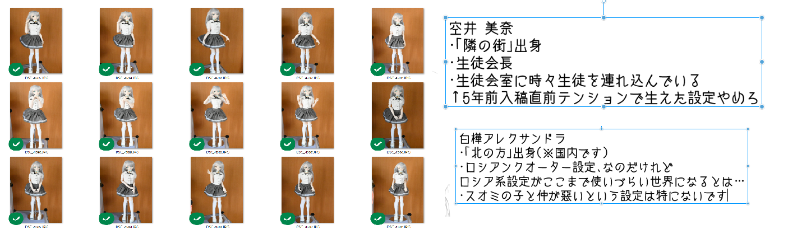

# 今回の進捗

## 2022.04.02 モチ会 88 回

### tackman

---

# 今週の内容

- ドローンの法規制と合法的に飛ばす方法について把握した
- ポモドーロテクニックが良かった話
- コミティア進捗

---

# ドローンを飛ばすための法律知識

ふらっと某ドローンカフェに行ってドローンを飛ばしたくなったところ、法律を向き合う必要があると分かったので調べた

- 住宅等密集地で飛ばすには飛行許可がいる
- 目視外飛行（カメラだけ見ての飛行）にも許可がいる
- 許可を得るために10時間以上、規定の練習が必要
  - → 目視飛行ができる場所がないと詰んだりする
  - 23区内はほぼアウトなのだけれど、荒川河川敷は規制区域外の場所があり自宅からアクセスできる範囲だった。僥倖！

余談：カフェの店員は上記を元にしたあいまいな情報で「飛行にはライセンスが必要でウチは○○万円の講習料で行けますよ」などとあいまいな知識の客(私)に営業をかけていた。講習時間的にぼったくりというほどではなかったけれど、新しい分野らしく山師が多い模様

---

# ポモドーロテクニックが身体に合った

- 1000円くらいの安いトマトキッチンタイマーを買った
- カチカチ音が結構するけれど、RTA中のような感覚になり自分には合っていた
- タイマーのネジを巻くと気持ちのネジも巻かれる気がする

パスタ・インドカリー・映画に加えてタスク処理もトマトの世界だった

https://www.youtube.com/watch?v=fy0fTFpqT48

---

# コミティア進捗

- 自分向け整理も兼ねてキャラ設定画描いてる(2/7)
- ラフをざっと描くだけなら一人1時間程度でいけると分かったので、今日明日で全員分やっちゃう予定
  - うちの子に取ってもらったポーズのトレスで7割終わるので楽

---

# 参考文献

- ドローン関連
  - https://www.mlit.go.jp/koku/koku_fr10_000042.html
  - https://elaws.e-gov.go.jp/document?lawid=327AC0000000231 132条～
  - https://jstatmap.e-stat.go.jp/jstatmap/main/trialstart.html 人口密集地確認
- アタック・オブ・ザ・キラートマト解説 https://dic.nicovideo.jp/a/%E3%82%AD%E3%83%A9%E3%83%BC%E3%83%88%E3%83%9E%E3%83%88