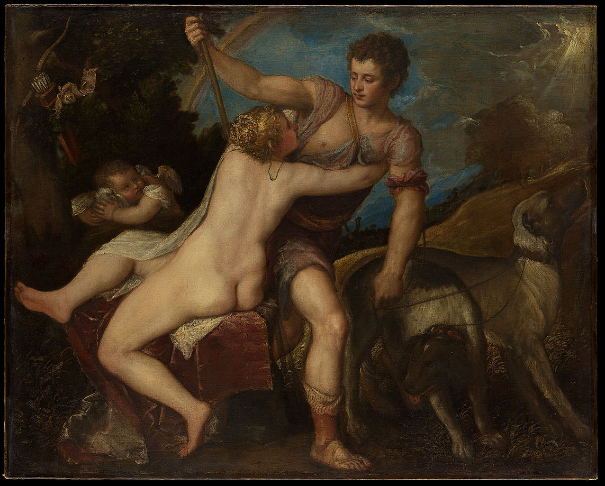
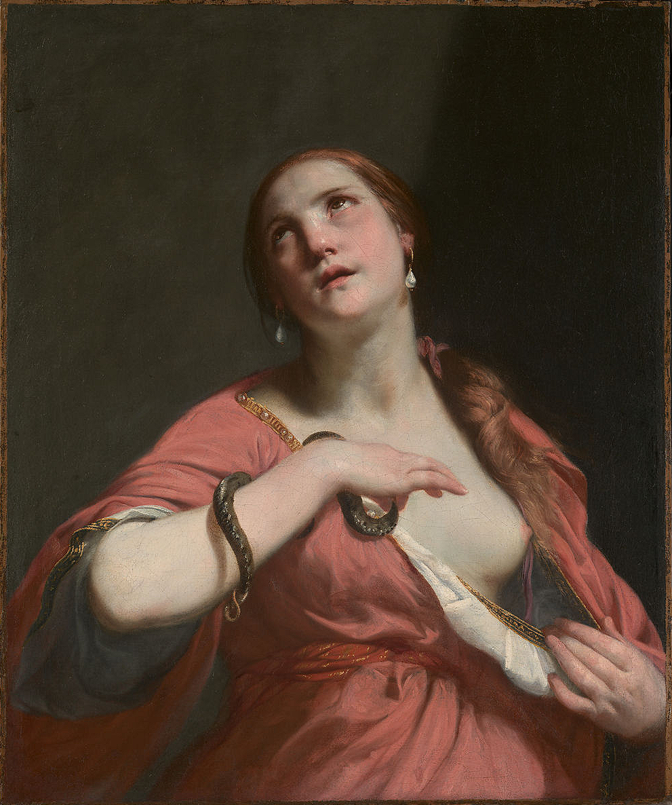
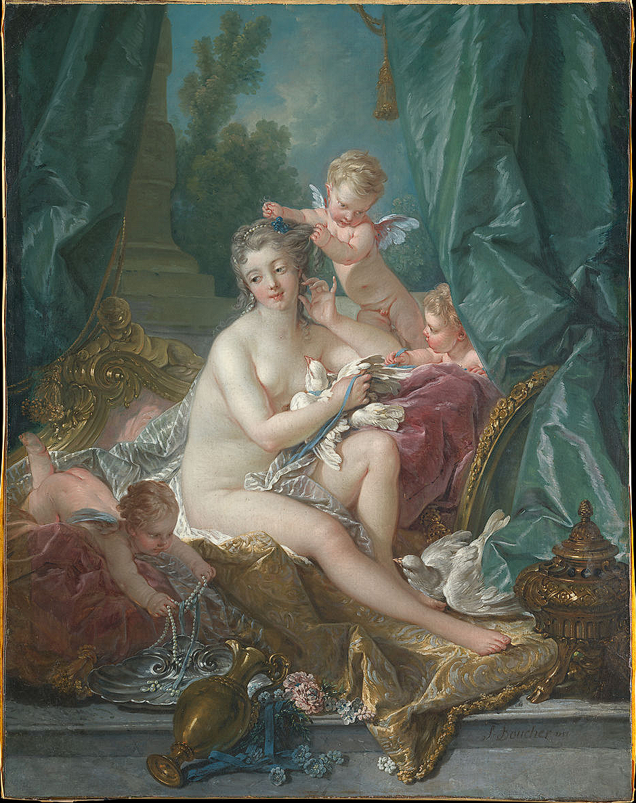
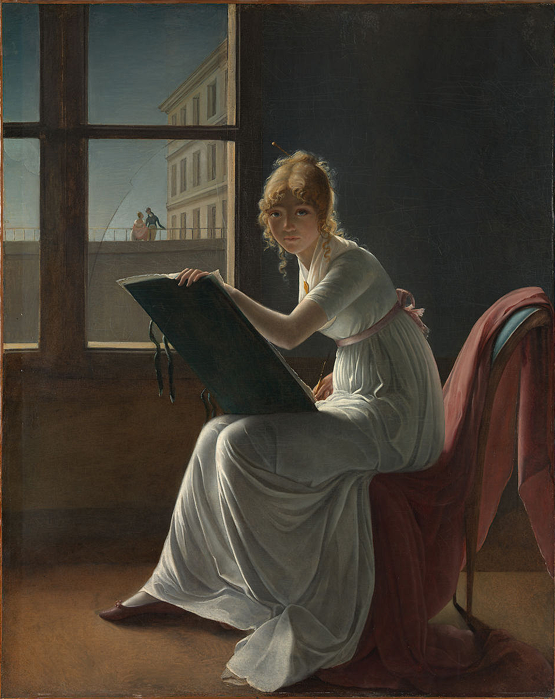
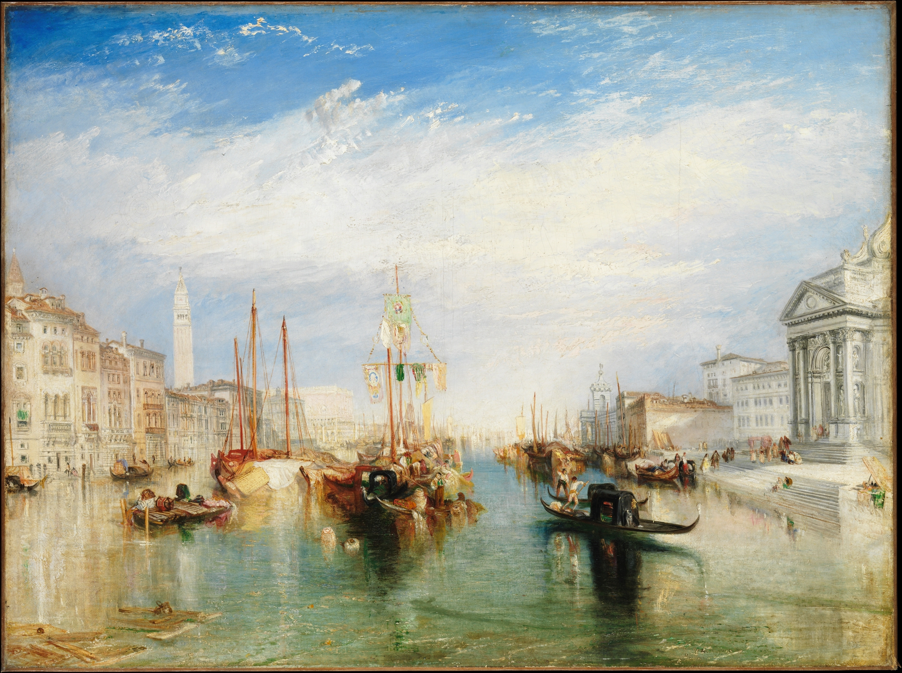

# 今回の進捗

## 2022.04.16 モチ会 89 回

### tackman

---

# やったこと

- メトロポリタン美術館展行ってきた
  - 良かったです（こなみ）
  - 「風景画だしオランダでしょ」という程度の知識はついてきた、気がする
  - 新国立美術館はガラスの茶室も展示されていてお得
- コミティアのサーチケが届いてしまった。うう…
  - 設定画一応7人分描いた
  - 構図これで行けるというやつ1枚

4～5月あたりに案件の切れ目で週3労働化している見込みでコミティアに申し込んだので、みなし週6労働の現状は想定外…

---

# メトロポリタン美術館展：時代ごとにこれ好き紹介

- 実物を見ておっとなったやつの紹介
- ディスプレイ越しとは違う体験なので、行ける人は現地行きを強く推奨
- MET collection Webで超高解像度画像がパブリックドメインで公開もされています
  - https://www.metmuseum.org/art/the-collection

---

# 中世

---

# ティツィアーノ「ヴィーナスとアドニス」

---

# 絶対主義時代：

---

## グイド・カニャッチ「クレオパトラの死」

この人はこのモチーフの作品を何枚も描いたらしいです

---

# ブーシェ「ヴィーナスの化粧」

貴婦人の浴室用に描かれたという背景を踏まえると、商業作品としてなるほどに

---

# ドーニュ「マリー・ドニーズ・ヴィレール」

作者は女性画家という文脈も合わせて大迫力の一点

---

# 革命以降

---

# ターナー「ヴェネツィア、サンタ・マリア・デッラ・サルーテ聖堂の前廊から望む

存在しない風景シリーズ

---

# 参考文献

- https://www.metmuseum.org/art/collection/search/437826
- https://www.metmuseum.org/art/collection/search/670765
- https://www.metmuseum.org/art/collection/search/435739
- https://www.metmuseum.org/art/collection/search/437903
- https://www.metmuseum.org/art/collection/search/437853