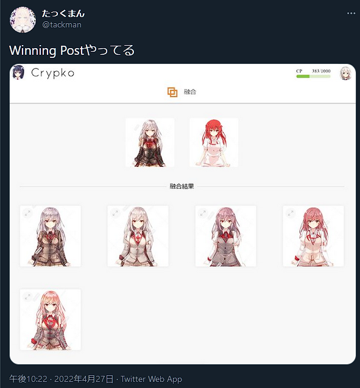

# 4月最終日…だと…？

## 2022.04.30 モチ会 90 回

### tackman

---

# 今回までの進捗

- ゲムマ出展＆久々にオフボドゲ会
  - ボドゲをやらないとボドゲが生まれないことを再確認
- Crypkoを触っていたらゲームを孕んだ
- 労働を片付けてGW中全力を出せるようにした

---

# Crypkoの紹介

https://crypko.ai/

- エーアイとかやってる方面では超有名なPreferred Networksからのスピンアウト
- 美少女イラスト生成ではWaifuLabsより先に出たものが前身
- 2つの異なる「親」キャラクターから「子」を生成できる
- 髪色や瞳など「属性」だけを編集する機能もある
- 顔だけでなく上半身生成モデルもある

---

# 生成品質に関して

- 顔だけならWaifuLabsと toss up
  - Crypkoの交配や属性編集機能を加味するとCrypkoに軍配は上がると思います
- 上半身はロングヘアーも全部見えるのが嬉しい
  - が、服が顔と抱合せになる＆服の生成品質はそこまで良くない
  - 「非標準ポーズ」に至っては頻繁にクリーチャーが生成される
- 総合すると、顔+髪型までのキャラクター生成には使えそう
  - ゲーム素材等そのまま利用したい向きには別のハードルがある

### その他

- 課金(約1000円/月)しないとまともに生成権利をもらえない
- Plansを見る感じだと、将来的に商用利用可能のライセンスはありそう

---

# 雑記

- 服単体で生成する需要もCrypko等のサービスで生まれそうな感じ
- 上手くやればなんかできそうな気もする

---

# 競馬

天皇賞・春ですよ、トレーナーさんっ！

- ステゴ一門+ディープボンド・タイトルホルダーでいいのでは？
  - -> ステゴ一門出走し過ぎ問題
  - 流石に絞らないと死
- アイアンバローズ・マカオンドール・タガノディアマンテ・タイトルホルダー・シルヴァーソニック・ディープボンド(+メロディーレーン)あたりかなあ
- テーオーロイヤル切るのは流石にホンマか感
- 大外に飛ばされて不人気してるディープボンド・タイトルホルダーを素直に買えばいい説もある