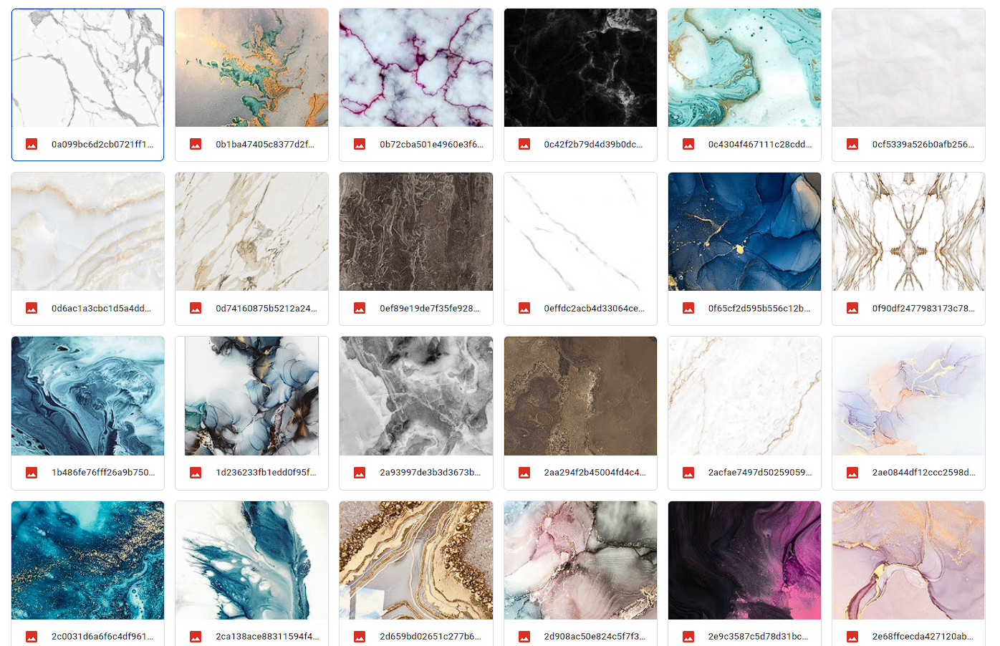
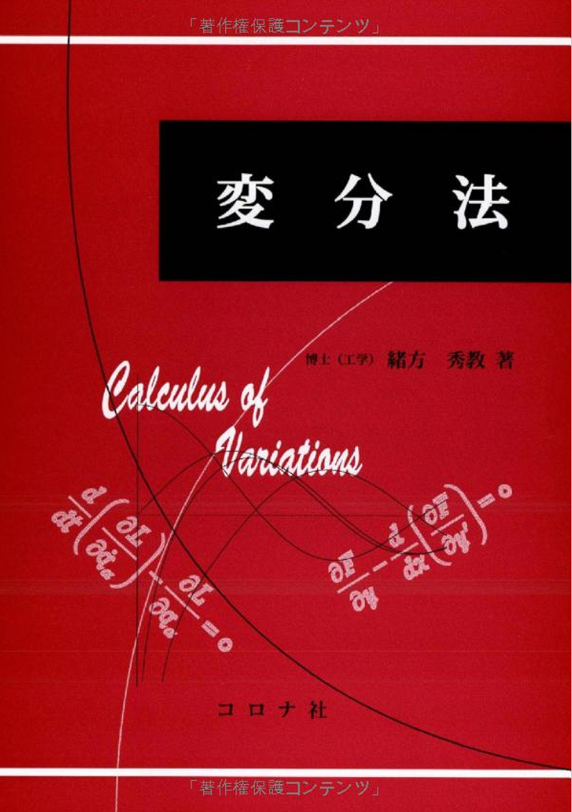
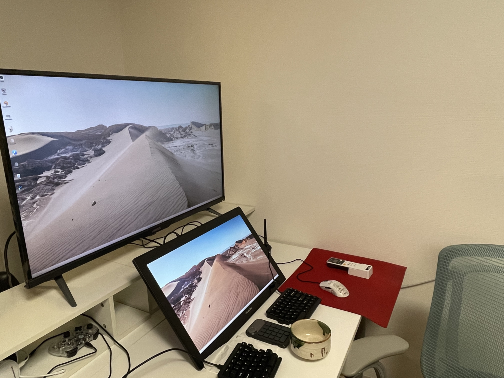

# 今回の進捗

## 2022.07.09 モチ会 93 回

### tackman

---

# 今回までにやったこと

- テクスチャ無限生成
  - データセットの画像集めた
  - StyleGAN3の公式実装を見る→うーんとなる→自分でスクラッチで実装するかになる→せっかくだからdiffusion modelやるか ←イマココ
- 液タブ導入からいろいろ模索していたディスプレイ配置がようやく最終形に
- 無造作な物理積読スペース→秩序ある積読スペースへ

---

# データセット(大理石)

---

# Colabで学習を回す

- ColabはNotebookを使うサービスだけれど、Linuxコマンドも実効できる
- 外のリポジトリからソースコードを引っ張ってきて、通常のPythonプログラムとして実行可能
- 月1000円程度の課金でグラフィックメモリ16GB搭載インスタンスが使える
  - 通常のクラウドインフラのGPUインスタンスと比べて激安
  - 自宅GPUサーバと比べても電気代で圧倒的に安い（特にこの夏は…）
- 代償として使いづらい（Notebook向けサービスなので当然）、つらみは高い
  - 安さのためだけにハックしている不健全な状態なので、いい感じのサービス登場して欲しい

---

# Diffusion Modelとは

1. 生成モデルの一種（生成モデル＝GANとかVAEとか）
2. 学習データに対してT回ノイズ（正規分布βN(0,α), βは小さい値）を何度も足して行くとT→∞でノイズになる
3. ↑の逆変換を無敵のディープラーニングで求めることができれば、ノイズから学習データ（の分布を持つ新しい生成結果）を作れる

### pros/cons

- GANより構造的な見通しが良い
- GANより高精細画像の生成に成功している例が多い
- 計算量は基本的にGANより大きくなる

---

# 書籍紹介：変分法

https://www.amazon.co.jp/%E5%A4%89%E5%88%86%E6%B3%95-%E7%B7%92%E6%96%B9-%E7%A7%80%E6%95%99/dp/4339061018/

- Diffusion Modelの調査中に変分法の復習したくなったので読んだ
- 解説が高校生でも読める丁寧さ（部分積分を1ステップごとに書いあったり）

---

最終的な配置

---

# 参考文献

- Diffusion Modelの解説 https://www.assemblyai.com/blog/diffusion-models-for-machine-learning-introduction/