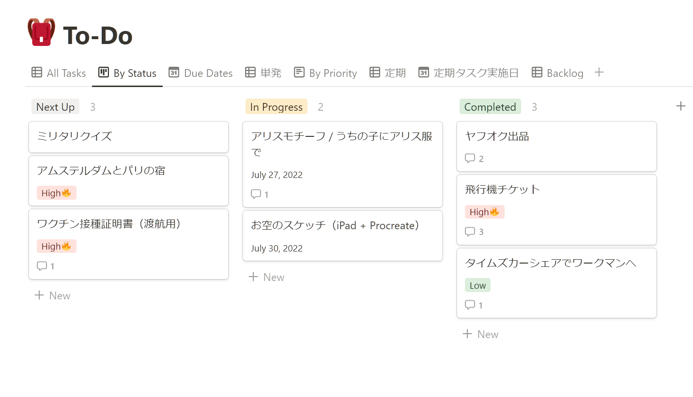

# 今回の進捗

## 2022.07.30 モチ会 94 回

### tackman

---

# 今回までにやったこと

- タスクボードをnotionに移行
- Essen spiel行き準備
- 車の運転リハビリ
- Ark Novaの攻略本を書く準備
  - として連日3～4時間かかるゲームをやっていた
- 仕込みをやってはいる、形になるのはもうちょっと先・・・
- CI/CD（継続的インプット・継続的断捨離）ちょっとずつやれた

---

---

# Why notion?

- notion： カテゴリとしてはScrapbox系のツール
- これまで個人タスクはシンプルなTODOリストでやっていたが限界を感じたので、TODOツール引っ越しが直接のきっかけ
  - 積みアニメリストみたいなのが無限に溜まったりしていた

### notion でのいいところ

- kanban ready (テンプレートから選択可能)
- DBとしての機能がある
  - 賛否はあるが個人で使う分には便利
- 簡単なカスタムフィルターを作れる
  - SELECT * FROM tasks WHERE deleted = 0 AND category = '単発' くらいのカスタム性はある
- UIが好き（個人の感想です）

---

# Essen spielに行く準備

やることが…やることが多い（画像略）

- ☑ パスポートの取得
- ☑ 航空機チケットの手配
- ☑ 旅程の確定
- □ ワクチン接種証明書の発行
- □ 現地の宿の手配
- □ 現地での鉄道の手配
  - 欧州の鉄道は事前予約するとめちゃ安く、当日購入は高いらしい
  - 日本でいう在来線特急くらいの値段で高速鉄道に乗って都市間移動できる
    - 新幹線っていいお値段するんだなって…

---

# その他のこと / 日記

- 5年ぶりにハンドルを握ったけどなんとかなった
- 仕込み段階のものはちょっとずつサーベイ中のフェーズ
- 「統計学への確率論，その先へ　第2版」読み始めた
  - まだ途中だけど、実務者向けの数学書という感じでよさそう
  - http://www.rokakuho.co.jp/data/books/0125.html