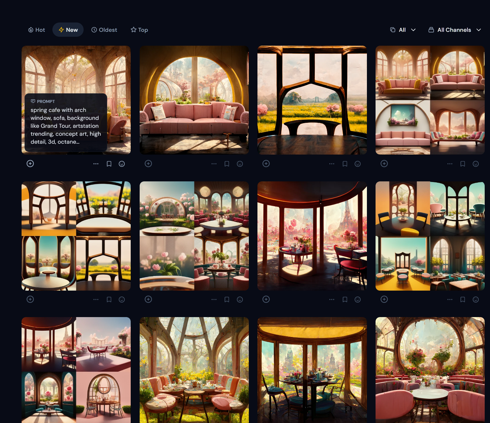

# 今回の進捗

## 2022.08.13 モチ会 95 回

### tackman

---

# 今回やったこと

- MidJourney
  - テキスト入力すると絵を生成してくれるやつ
- もろもろあってVAEをスクラッチで書いてみることにした
- ↑ついでにJAX入門

---

# MidJourney

https://www.midjourney.com/home/

- 自然言語で指示をするとそれに合った絵を生成してくれる
- Discord botなのでとっつきやすいし扱いやすい
  - プライベートサーバーにbot招待をして運用も可
- 課金すればほぼ自由に商業利用できる
  - 月$30で画像生成枚数無制限で使い放題(!) + 商業利用可能
- とりあえず今月$30課金して期間中使い倒してみることにした

---

猿のようにAIと対話している

"spring cafe with arch window, sofa, background like Grand Tour, artstation trending, concept art, high detail, 3d, octane rendering"

---

# 使用感

- 背景はこれで行ける気がする、行きたい
- 背景+生物全般を含む絵はちょっと厳しい
  - 顔がちゃんと出せない、トポロジー的にそうじゃないものが出るなど
  - ポートレートなら何とかなるかもしれないけどあまり探ってないです
- 呪文詠唱＝ググりスキル的な専用技能
  - 非本質的過ぎるスキルではある
  - けどググりスキルでご飯食べる職ことソフトウェアエンジニアをやっているので今更だと割り切れる

---

