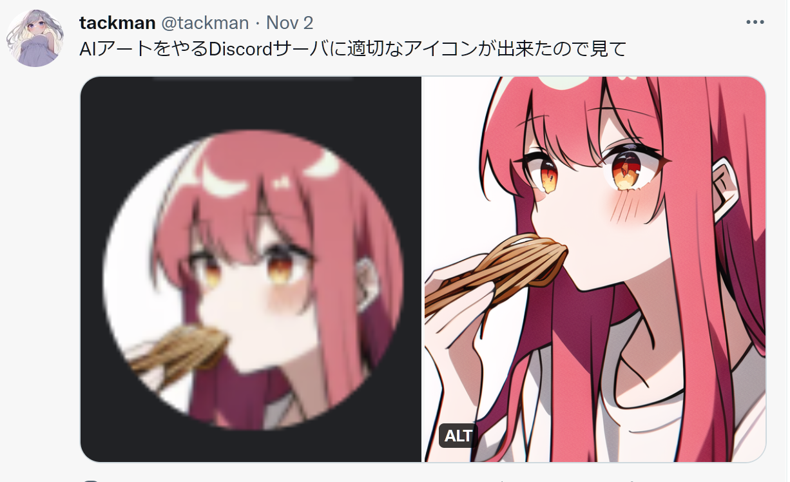
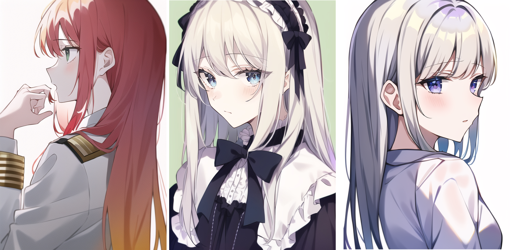
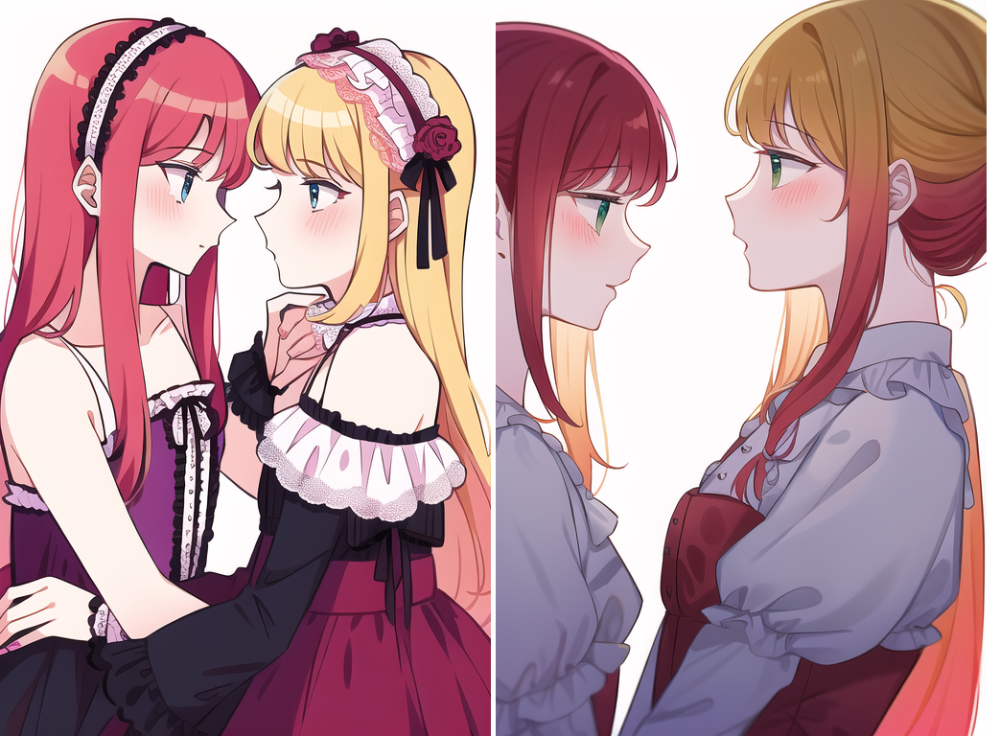

# 今回やったこと

## 2022.11.05 モチ会 98 回

### tackman

---

# 日記系

- 久々にオフボドゲをやりEssen Spiel戦利品を消化した
  - やはりオフボドゲは効く…！
- [ゲムマで小冊子として出そうと思っていた記事](https://tackmans-gaming.hatenablog.com/entry/2022/11/01/040211)をブログにした
  - 約1万字、まだまだ書けることはある
  - これを投げたことでEssen Spiel同行者のSpielガイド本が立ち上がった感
- （自分の中で）第二次ブログブーム
  - ↑のEssen Spiel記事と一口馬主・POG日記で既に2万文字くらい書いた

帰国してからも一週間くらいは調子が悪かったので、ようやく動き始めてきた

---

# 人類の還る場所、はてな

- ゲーミングブログ（七色には光らない）と一口馬主ブログをはてなで立てた
  - はてなでブログやるのは干支一周ぶりくらい…？
- いつの間にかmarkdown入力できたり、レスポンシブなテーマが提供されるようになっていた
  - markdown入力が出来るようになっていたのは個人的に大きく、筆が進む理由になっている
    - 昔ははてな記法という独自マークアップを覚えてのう…

生き残ったはてなは進化していた。生き残るサービスは強いと見直し

---

# AIアートやるDiscord部屋立てた

- 今のところ実質2名、ほぼNovelAI
- 数日でなかなかの勢いで知見が溜まってきています

---

# デイリーアイコン

- 0マナ5分で生成できるので毎日同じ子で違うアイコンを作る日課化
- アイコン用生成がこなれてきたら全身画、背景つきもやっていきたい
  - 筋トレなので

---

# NovelAI エピソード集

- ネガティブプロンプトからhuge breasts外した瞬間に爆乳化するけど入れると無乳に近くなる
- {{{looking at viewer}}}を強めにnegに入れると、yuriとか2girlsと明示しなくても確率的に百合画像出してくる
- ポケットに手を入れさせると解剖学的崩壊を避けられる
- ネガティブに{{{azur lane}}}を入れることで臭みが抜ける

